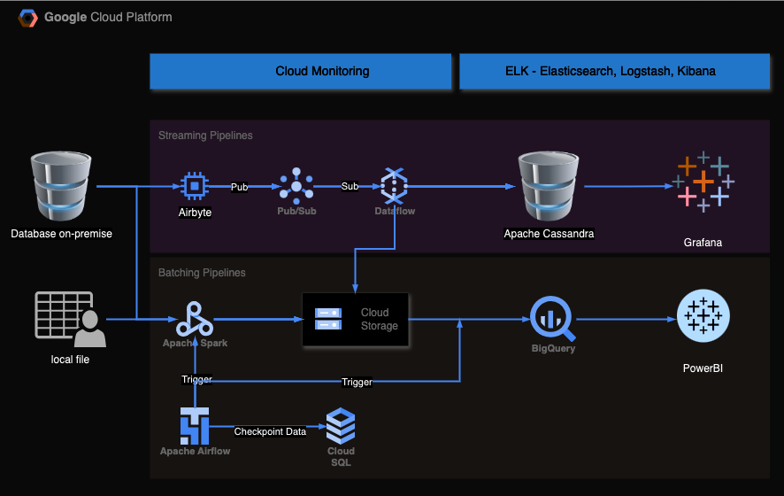

# Data Engineering and Machine Learning Tasks for Insignia

## Task Overview
This project includes the following tasks:
1. Creating a data pipeline flowchart.
2. Writing SQL queries to fill NULL values in a table.
3. Building a script to transform raw data to a desired format.
4. Explaining key machine learning concepts.

## 1. Data Pipeline Flowchart

I'm proficient with all tech stack in that design.

## 2. SQL Queries to Fill NULL Values
you can check the answer in this [sql file](task_2.sql)

## 3. Data Transformation Script
you can check the answer in this [jupyter notebook file](task_3.ipynb)

## 4. Machine Learning Concepts
you can check the answer in this [file](task_4.md)

## 5. Data Science Secret
- **Secret**: One thrilling secret in Data Science is that the majority of a data scientist's time (around 80%) is spent on data cleaning and preprocessing, rather than building models or analyzing results. This often comes as a surprise to many newcomers who expect to spend most of their time on model development.
